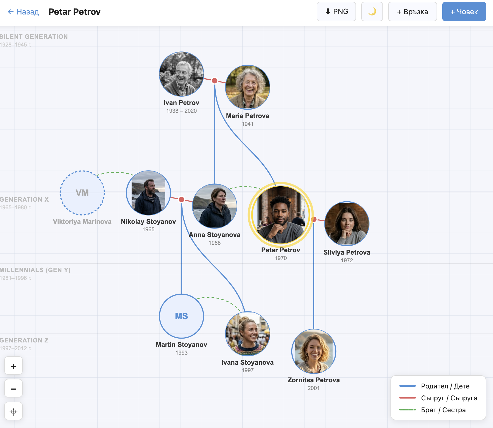

# 🌳 Family Tree Visualization App



> 🤖 **AI-Driven Project** — Built entirely with [Claude Code](https://claude.ai/code) & [Google Antigravity](https://antigravity.google).

An interactive web application for visualizing, creating, and managing a family genealogy tree. The project features a containerized architecture, a modern Angular frontend rendering graph structures via D3.js, and a fast FastAPI backend powered by a PostgreSQL database.

---

## ✨ Features (v1.0)

* 📊 **Interactive D3.js Graph**: View relationships in a hierarchical structure with generations stacked vertically and custom layout physics.
* 👥 **Detailed Profiles & Biography**: Rich biographical records, including:
  * First name, last name, profile photo, and biography.
  * Dates, times, and places of birth and death.
  * Education, profession, and places of residence.
* 💍 **Spouse Relations & Divorces**:
  * Record marriage dates and locations.
  * Track divorces (rendered visually as dashed red connection lines for immediate visibility).
* 🔍 **Intuitive Controls**:
  * Standard drag (pan) and wheel (zoom) gesture controls.
  * Dedicated on-screen zoom buttons (`+` / `-`).
  * Auto-center button (⌖) that calculates coordinates of all active family members and scales the tree to fit your screen perfectly.
* 📱 **Mobile Responsive Design**:
  * Adaptable layout that scales smoothly across smaller devices.
  * On mobile phones, a selected person's detailed card slides up from the bottom as a **Bottom Sheet** overlay with backdrop-blur styling.
* 💾 **One-Click JSON Backup**:
  * Export the entire database (people, relations, gallery info) into a single JSON file.
  * Restore/import the backup file securely through the web UI (wrapped in database transactions to protect data integrity).

---

## ⚡ Quick Start

To run this application locally, you need **Docker** and **Docker Compose** installed on your system.

1. Clone the repository:
   ```bash
   git clone https://github.com/your-username/family-tree.git
   cd family-tree
   ```

2. Spin up the services in detached mode:
   ```bash
   docker compose up --build -d
   ```

3. Open your browser and navigate to:
   - **Frontend App**: [http://localhost](http://localhost) (Port 80)
   - **Backend API Docs (Swagger)**: [http://localhost:8000/docs](http://localhost:8000/docs)

---

## 📂 Importing Sample Data
We have provided a demo family tree file named **`sample-family-tree.json`** in the project root. It includes three generations of a family tree (Chen/Miller family), representing spouses, divorces, children, and biographical details.

1. Open `http://localhost`.
2. Click **"Import"** in the top right corner.
3. Choose `sample-family-tree.json` and confirm.
4. The interactive tree diagram will populate instantly!

---

## 📚 Documentation & Reference

For guides in Bulgarian or deeper technical details, check the following resources:
* 🇧🇬 **Българска версия**: Read [README_bg.md](README_bg.md) for the Bulgarian version of this guide.
* 🛠️ **Detailed Architecture**: See [DOCUMENTATION.md](DOCUMENTATION.md) ([DOCUMENTATION_bg.md](DOCUMENTATION_bg.md)) for details on D3 tree calculations, JSON schemas, and responsive style implementation.
* 🍓 **Raspberry Pi Deployment**: See [deployment_raspberrypi.md](deployment_raspberrypi.md) ([deployment_raspberrypi_bg.md](deployment_raspberrypi_bg.md)) for instructions on building and transferring Docker images to a Pi without local compilation.
* 📝 **Roadmap**: See [TODO.md](TODO.md) ([TODO_bg.md](TODO_bg.md)) for completed v1.0 milestones and upcoming v2.0 ideas.
