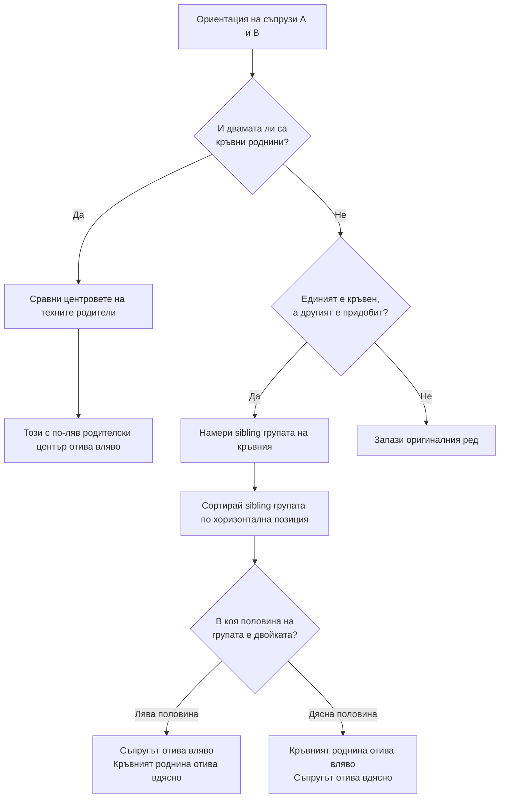

# Механизъм за позициониране и подредба на фамилното дърво

Този документ описва детайлно алгоритъма за хоризонтално и вертикално позициониране на ноудовете в интерактивното фамилно дърво. Алгоритъмът е разработен с цел избягване на пресичането на връзките (родител-дете, съпрузи, братя/сестри), поддържане на компактни разстояния и осигуряване на естествено разположение на поколенията по времевата линия.

---

## Архитектура на алгоритъма

Процесът се състои от пет основни етапа:
1. **Пропагиране и оценка на рождените години** (Birth Year Estimation).
2. **Разделяне по поколения / равнини** (Generation Row Mapping).
3. **Едноредово последователно сортиране** (Level-by-level Sequencing).
4. **Ориентация на съпрузите в двойки** (Spouse Orientation).
5. **Физическа релаксация и резолюция на ограниченията** (Relaxation & 1D Constraint Sweeps).

---

## 1. Пропагиране и оценка на рождените години

Тъй като в базата данни за някои лица липсват рождени години, алгоритъмът извършва итеративно изчисление на приблизителната година на раждане на всеки възел:
* **Директна рождена година**: Ако лицето има въведена година в БД, тя се приема за фиксирана.
* **Връзка Родител-Дете**: Пропагира се средно отместване от **-28 години** нагоре (към родителите) и **+28 години** надолу (към децата).
* **Връзка Братя/Сестри & Съпрузи**: Копира се годината със средна делта от **0 години** (с цел поставянето им в една и съща хоризонтална равнина).
* **Итеративност**: Алгоритъмът се изпълнява до пълно насищане ( convergence ), докато всяко лице в дървото получи оценена рождена година.

---

## 2. Разделяне по поколения

Ноудовете се разпределят по вертикални редове (`r = 0, 1, 2, ...`):
* Базира се на оценената рождена година, преобразувана по скала, разделена на фиксирани генерации:
  * **Silent Generation**: 1928 – 1945 г. (Ред 0)
  * **Generation X**: 1965 – 1980 г. (Ред 1)
  * **Millennials (Gen Y)**: 1981 – 1996 г. (Ред 2)
  * **Generation Z**: 1997 – 2012 г. (Ред 3)
* Вертикалната координата $Y$ на даден възел се определя от рождената му година:
  $$Y = \text{базова\_координата\_на\_реда} + (\text{рождена\_година} - \text{начало\_на\_генерацията}) \times \text{YEAR\_GAP}$$
  *Това позволява лицата, родени по-късно в рамките на едно поколение, да се изобразяват малко по-ниско от по-възрастните, формирайки ясен времеви поток.*

---

## 3. Едноредово последователно сортиране

След разпределянето на възлите по редове, за всеки ред се изгражда плоска хоризонтална последователност. За избягване на цикли или раздвоения, възлите се групират в последователни блокове (`SeqUnit`):
* **Двойка (Couple)**: Съпруг и съпруга се разглеждат като един неделим хоризонтален блок.
* **Единичен (Single)**: Лица без регистриран съпруг в дървото.

### Правила за сортиране по редове:
1. **Първо ниво (Ред 0)**: Блоковете се сортират по средната рождена година на членовете им.
2. **Следващи нива (Ред $r > 0$)**: Блоковете се сортират по **родителския им барицентър** (barycenter) – средната хоризонтална координата $X$ на техните родители от предходните редове. При равенство или липса на родители се използва барицентърът на родителите на техните братя/сестри (sibling fallback).

---

## 4. Ориентация на съпрузите в двойки

За да се предотврати пресичането на линиите към децата и родителите, партньорите във всяка двойка (`u.aId` и `u.bId`) се подреждат хоризонтално по следните правила:

### Защо това предотвратява пресичането?
* **Кръвни роднини в средата**: Братята и сестрите, които са родени в семейството, се привличат към центъра на семейството си.
* **Придобити съпрузи по фланговете**: Придобитите партньори се позиционират по външните краища (флангове), осигурявайки директен достъп на родителските линии към децата им без да пресичат връзката на съседните семейства.

---

## 5. Физическа релаксация и ограничение в 1D

След като хоризонталният ред на всички възли е дефиниран, първоначалните хоризонтални координати се задават с еднаква стъпка `X_GAP = 120` пиксела. След това се извършват **20 итерации на релаксация** (relaxation sweeps):

### Изчисляване на целева позиция (Target)
За всеки възел се изчислява желаната позиция на база сили на привличане:
* **Родителско привличане** (Тегло = 2.0): Дърпа възела към средната позиция на родителите му.
* **Детско привличане** (Тегло = 2.0): Дърпа възела към средната позиция на неговите деца.
* **Сдвояване със съпруг** (Тегло = 1.5): Привлича го към съпруга/съпругата му с отместване от $\pm \text{X\_GAP}$ (в зависимост от ляв/десен партньор).

$$\text{Target } X = \frac{2.0 \times \text{Mean}(X_{\text{parents}}) + 2.0 \times \text{Mean}(X_{\text{children}}) + 1.5 \times (X_{\text{spouse}} \pm \text{Offset})}{2.0 + 2.0 + 1.5}$$

### Итеративно прилагане на ограниченията
За запазване на сортирания ред и предотвратяване на застъпването на ноудовете:
1. **Ляво-към-дясно сканиране (Left-to-Right Sweep)**:
   Ако $X_i < X_{i-1} + \text{X\_GAP}$, то $X_i$ се избутва надясно до $X_{i-1} + \text{X\_GAP}$.
2. **Дясно-към-ляво сканиране (Right-to-Left Sweep)**:
   Ако $X_i > X_{i+1} - \text{X\_GAP}$, то $X_i$ се избутва наляво до $X_{i+1} - \text{X\_GAP}$.

Това двупосочно избутване гарантира, че минималното разстояние между два съседни възела на един и същ ред винаги остава точно `X_GAP` пиксела, без да се променя предварително изчислената оптимална хоризонтална последователност.
